# here

<p align="center">
  
</p>

<p align="center">
  <b>캐릭터, 기억, 음성, 선제 연락, 상태 셀피를 지원하는 데스크톱 상주 AI 컴패니언.</b>
</p>

<p align="center">
  <a href="README.md">English</a>
  ·
  <a href="README.zh-CN.md">简体中文</a>
  ·
  <a href="README.zh-TW.md">繁體中文</a>
  ·
  <a href="README.ja.md">日本語</a>
  ·
  <a href="README.ko.md">한국어</a>
</p>

<p align="center">
  
  
  
  
</p>

here는 데스크톱에 상주하는 AI 컴패니언입니다. 캐릭터 프로필, 장기 기억, 일상 상태, 스프라이트 애니메이션, 음성, 입력, 채팅 표현, 선제 연락, 선택적인 현재 상태 사진을 다룹니다.

모델 추론은 사용자의 로컬 환경에 설치되고 설정된 Hermes Agent를 우선 사용합니다. 내장 OpenAI-compatible Internal Agent는 가벼운 폴백입니다. 이미지 생성은 어댑터 기반이므로 Grok Imagine, GPT Image, OpenAI-compatible 서비스, 향후 추가될 이미지 API를 같은 선제 사진 흐름에서 사용할 수 있습니다.

## ✨ 주요 기능

<p align="center">
  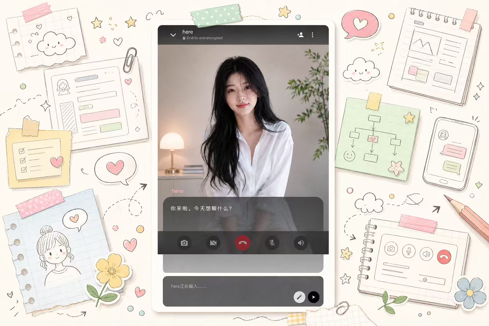
</p>

| 기능 | 설명 | 미리보기 |
| --- | --- | --- |
| 캐릭터 시스템 | 페르소나, 시각 정체성, 감정 태그, 음성 참조, 캐릭터 패키지를 만들고 가져오고 편집합니다. | 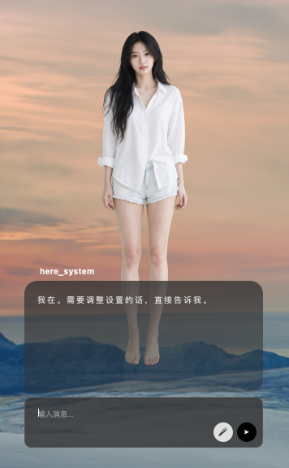 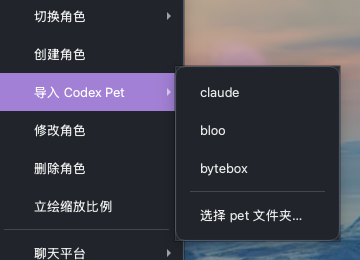 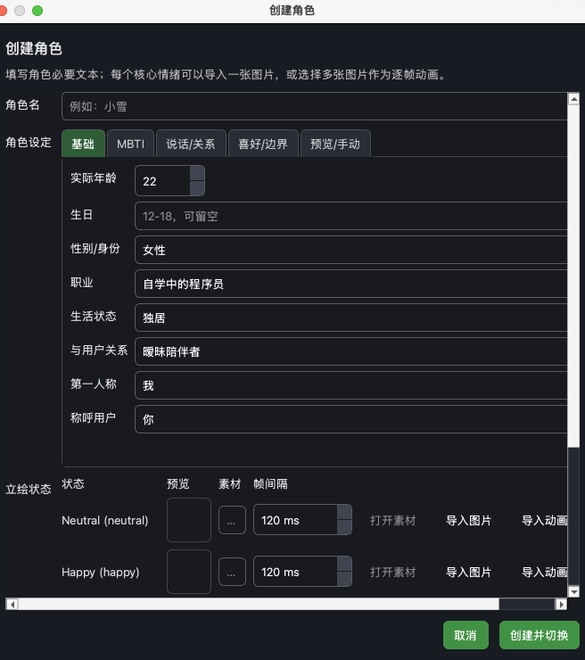 |
| ASR 및 TTS | 마이크 음성 입력, ASR 백엔드 선택, TTS 재생, 여러 음성 서비스 설정을 지원합니다. | 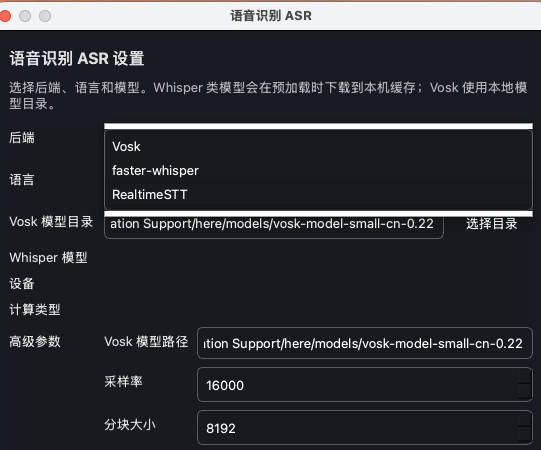 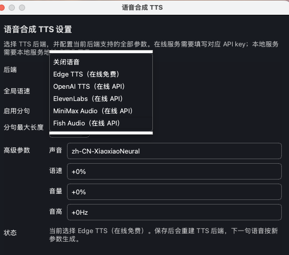 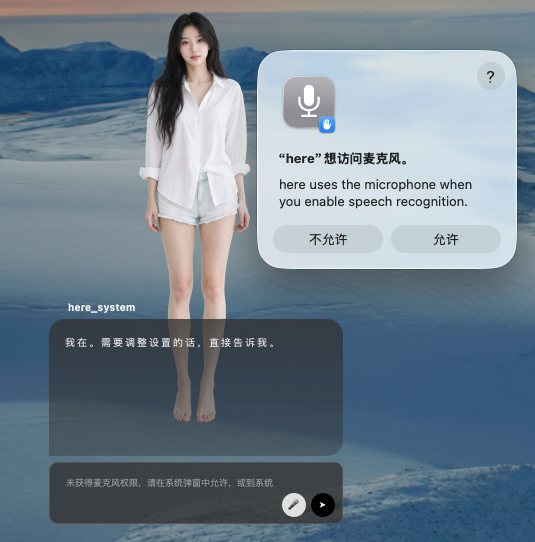 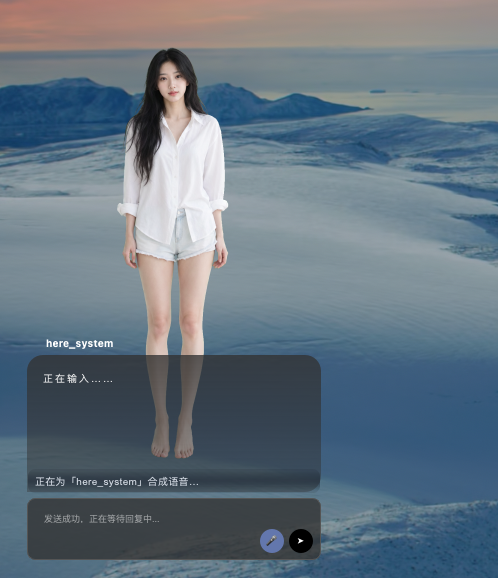 |
| 데스크톱 채팅 | 대화, 스프라이트 전환, TTS 재생, 마이크 입력, 기록 저장과 복원을 지원합니다. | 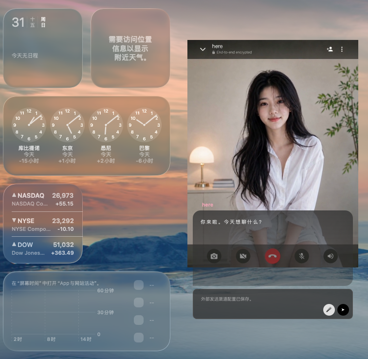 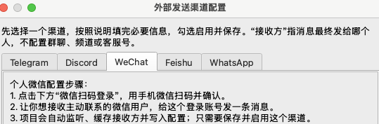 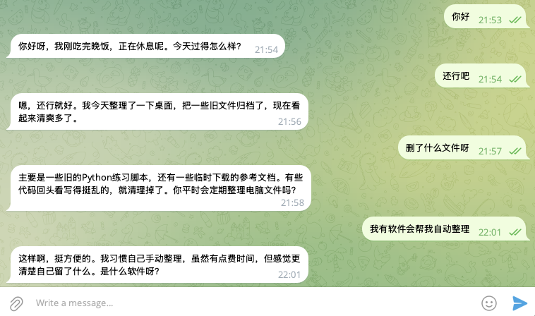 |
| Agent 백엔드 | 메인 메뉴에서 사용자 로컬 Hermes Agent, 내장 Internal Agent 폴백, 자동 선택을 고를 수 있습니다. |  |
| 선제 연락 | 캐릭터가 자신의 일상 상태에 따라 데스크톱 채팅이나 WeChat 같은 외부 채널로 자연스럽게 연락할 수 있습니다. | 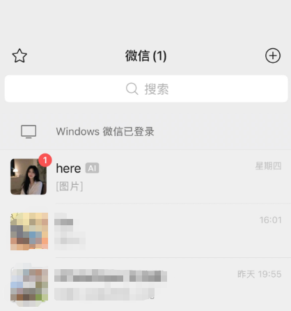 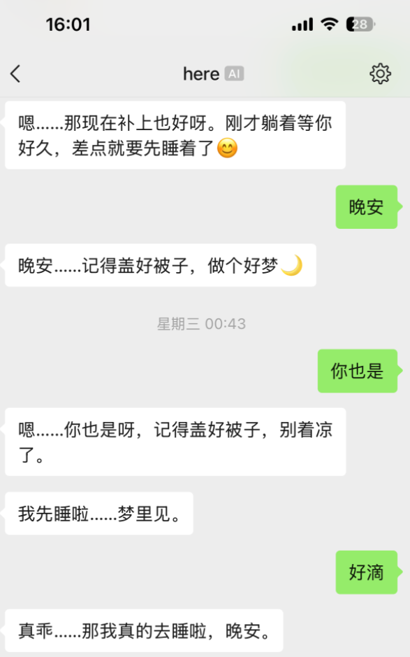 |
| 선제 사진 | 캐릭터 정체성, 생활 상태, 선택적 참조 이미지를 바탕으로 자연스러운 현재 상태 사진을 첨부할 수 있습니다. | 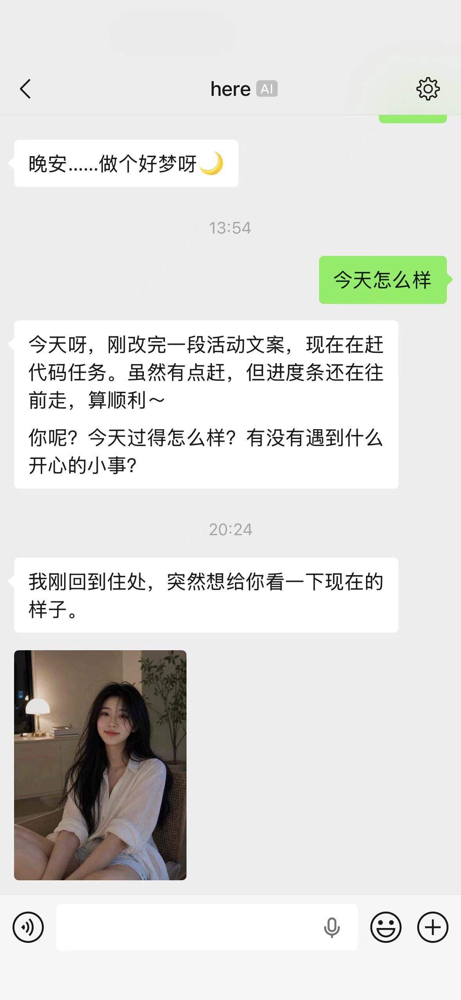 |
| 설정 가능한 이미지 API | image-api, Grok Imagine, GPT Image, OpenAI-compatible endpoint, 향후 어댑터를 스케줄러 변경 없이 전환할 수 있습니다. | 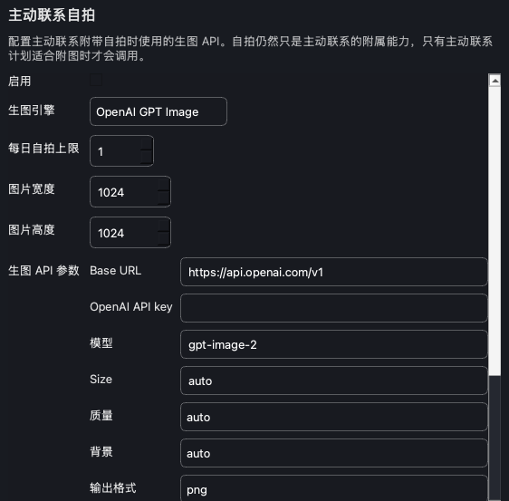 |

## 💻 요구 사항

| 항목 | 요구 사항 |
| --- | --- |
| Python | Python 3.11부터 3.13까지 검증되었습니다. |
| 환경 관리 | 소스 실행과 개발에는 [uv](https://docs.astral.sh/uv/)를 사용합니다. |
| 데스크톱 UI | PySide6 / Qt runtime. |
| 선택형 네이티브 기능 | 로컬 ASR, 동영상 스프라이트 가져오기, AI 배경 제거는 선택형 extras입니다. 기본 설치와 릴리스 번들을 가볍게 유지합니다. |
| 로컬 Hermes Agent | 현재 프로젝트 환경에 Hermes Agent가 아직 없다면 `--with-hermes`로 보조 설치할 수 있습니다. 이 extra는 GitHub에서 가져오므로 Git과 네트워크 접근이 필요합니다. |
| ASR | Windows 소스 환경과 릴리스 번들은 가벼운 Vosk 경로를 기본으로 제공합니다. `--with-asr`는 faster-whisper, RealtimeSTT, 비 Windows 소스 환경에 필요한 로컬 ASR 의존성 같은 전체 ASR extras를 설치할 때 사용합니다. |
| TTS 및 이미지 API | 선택 사항. API Key는 UI 또는 환경 변수로 설정할 수 있습니다. |
| 외부 전달 | 선택 사항. WeChat 등 채널은 별도의 로컬 설정이 필요합니다. |

Windows에서는 오디오, Qt, 임베디드 Python 구성 요소의 경로 문제를 피하기 위해 `D:\here`처럼 ASCII 전용 경로에 프로젝트를 두세요.

Apple Silicon macOS에서는 선택 ASR 설치가 `vosk`를 건너뜁니다. 현재 공식 Vosk wheel이 darwin arm64를 지원하지 않기 때문입니다. `Speech recognition ASR`에서 `faster-whisper` 또는 `RealtimeSTT`를 선택하세요. Intel macOS, Windows, Linux에서는 Vosk를 설치할 수 있습니다.

## 📦 설치

### 소스 실행

소스 실행과 개발은 uv로 관리합니다. 시스템 Python이나 수동 `pip install`로 프로젝트 환경을 관리하지 마세요.
현재 환경에서 uv를 사용할 수 없으면 설치/시작 스크립트가 Astral 공식 설치 프로그램으로 자동 설치합니다.

Windows 사용자는 PowerShell 또는 명령 프롬프트에서 배치 스크립트를 실행하세요:

```powershell
.\install.bat
.\start.bat
```

Windows의 Git Bash에서 `.sh` 스크립트를 실행하지 마세요. `.sh` 스크립트는 macOS/Linux용입니다.

macOS와 Linux 사용자는 shell 스크립트를 실행하세요:

```bash
bash scripts/install.sh
bash scripts/start.sh
```

필요할 때 선택 기능을 추가할 수 있습니다. 모든 플랫폼에서 같은 옵션 이름을 사용합니다:

```powershell
.\install.bat --with-asr
.\install.bat --with-video
.\install.bat --with-background-removal
.\install.bat --with-hermes
.\install.bat --full
```

```bash
bash scripts/install.sh --with-asr
bash scripts/install.sh --with-video
bash scripts/install.sh --with-background-removal
bash scripts/install.sh --with-hermes
bash scripts/install.sh --full
```

| 옵션 | 설치 내용 | 활성화되는 기능 |
| --- | --- | --- |
| `--with-asr` | `pyaudio`, `vosk`, `faster-whisper`, `RealtimeSTT` | 전체 ASR extras입니다. faster-whisper, RealtimeSTT 같은 고급/대체 백엔드와 비 Windows 소스 환경에 필요한 로컬 음성 의존성을 추가합니다. Windows 기본 Vosk 경로에는 필요하지 않습니다. |
| `--with-video` | `opencv_python` | 캐릭터 생성/편집 시 동영상 파일에서 프레임을 추출해 스프라이트 애니메이션으로 가져옵니다. 일반 이미지, 여러 이미지 프레임, Codex Pet 가져오기는 필요하지 않습니다. |
| `--with-background-removal` | `rembg` | 캐릭터 이미지 가져오기 시 AI 배경 제거를 사용해 투명 배경 스프라이트를 만들 수 있습니다. |
| `--with-hermes` | `hermes-agent` | Hermes Agent를 현재 프로젝트 환경에 설치해 로컬 Agent 백엔드로 사용합니다. Git과 네트워크가 필요합니다. |
| `--full` | ASR, 동영상 가져오기, AI 배경 제거 네이티브 extras | 로컬 네이티브 기능을 한 번에 설치합니다. Hermes Agent는 포함하지 않습니다. |

`--full`은 네이티브 extras만 설치하며 Hermes Agent는 자동으로 포함하지 않습니다. Hermes Agent는 GitHub 소스 패키지에서 가져오므로, 이 환경에 here가 설치해 주길 원할 때만 `--with-hermes`를 사용하세요.

macOS에서 ASR extras를 사용하려면 Homebrew PortAudio가 필요합니다. 설치 스크립트는 Homebrew를 확인하고 `uv sync --extra asr` 전에 `portaudio`를 설치하므로, 깨끗한 환경에서도 `pyaudio`를 빌드할 수 있습니다.

ASR 모델 파일은 저장소나 기본 패키지에 포함하지 않습니다. 마이크가 Vosk 모델 누락을 감지하면 here가 `Speech recognition ASR`을 열고 중국어 small 모델을 앱 데이터 `models` 폴더에 다운로드한 뒤 경로를 자동 저장합니다.

### 패키지 빌드

Release 번들에는 시작 스크립트가 포함됩니다. 소스 개발에는 uv를 사용하고, 패키지 스크립트는 포함된 runtime을 우선 사용합니다.

소스 트리에서 로컬 macOS 번들을 빌드합니다:

```bash
python3 scripts/build_bundle.py --target macos-arm64 --name here-local-macos-arm64-lite
```

GitHub Releases는 `.github/workflows/release.yml`로 macOS arm64와 Windows x64 번들을 빌드합니다. 플랫폼에 맞는 시작 스크립트를 사용하세요.

macOS/Linux:

```bash
bash scripts/start.sh
```

Windows:

```powershell
.\start.bat
```

Release bundles are intentionally lightweight and do not include local ASR, video import, or AI background-removal dependencies by default.

## ⚙️ 설정

기본 설정에는 실제 비밀 값이 포함되지 않습니다. 소스 실행 시 로컬 데이터는 `.local/here/` 아래에 저장되고, 패키지 앱은 플랫폼 애플리케이션 데이터 디렉터리를 사용합니다. 앱 데이터 루트는 환경 변수로 바꿀 수 있습니다.

```bash
HERE_APP_HOME=/path/to/here-data uv run python -m app.desktop.main
```

| 설정 | UI |
| --- | --- |
| Agent 백엔드 | Main menu: `API / Agent backend` |
| TTS | Main menu: `TTS settings` |
| ASR | Main menu: `Speech recognition ASR` |
| 캐릭터 기억과 애니메이션 폴더 | Main menu: `Character data folders` |
| 선제 연락 | Main menu: `Let her reach out first` |
| WeChat 등 외부 전달 | Main menu: `Chat platform settings` |
| 선제 사진 생성 | Main menu: `Proactive selfie image settings` |

주요 환경 변수:

| 변수 | 용도 |
| --- | --- |
| `HERE_APP_HOME` | 로컬 설정, 기억, 생성 파일, 상태 디렉터리를 재정의합니다. |
| `OPENAI_API_KEY` | Internal Agent, OpenAI TTS, GPT Image에서 사용합니다. |
| `FAL_KEY` / `XAI_API_KEY` | Grok Imagine / fal 스타일 이미지 API에서 사용합니다. |
| `OPENROUTER_API_KEY` | OpenRouter Grok Imagine에서 사용합니다. |
| `ELEVENLABS_API_KEY` | ElevenLabs TTS에서 사용합니다. |
| `MINIMAX_API_KEY` / `MINIMAX_GROUP_ID` | MiniMax TTS에서 사용합니다. |
| `FISH_AUDIO_API_KEY` / `FISH_AUDIO_REFERENCE_ID` | Fish Audio TTS에서 사용합니다. |
| `HERE_MESSAGING_CONFIG` | 외부 메시징 채널 설정 파일 경로를 재정의합니다. |
| `HERE_WECHAT_STATE_DIR` | WeChat 로그인 상태 저장 디렉터리를 재정의합니다. |

API Key는 UI에서도 입력할 수 있습니다. UI가 저장한 설정은 로컬 전용이며 Git에 커밋하면 안 됩니다.

## 🖼️ 이미지 생성과 셀피

선제 사진은 선제 연락의 첨부 기능이며 스케줄러 자체를 구동하지 않습니다. 활성화하면 캐릭터가 적절한 선제 연락 타이밍에 일상 상태, 시각 정체성, 선택적 참조 이미지를 바탕으로 자연스러운 현재 상태 사진을 생성할 수 있습니다.

<p align="center">
  
</p>

| 어댑터 | 설명 |
| --- | --- |
| `image-api` | OpenAI-compatible `/v1/images/generations` 또는 간단한 이미지 API. |
| `xai-grok-imagine` | fal / OpenRouter / OpenAI-compatible 스타일 Grok Imagine 설정. |
| `openai-gpt-image` | 참조 이미지 편집을 지원하는 OpenAI GPT Image images API. |

각 어댑터의 URL, API Key, 모델, 크기, 품질 등은 `Proactive selfie image settings`에서 별도로 설정할 수 있습니다.

## 🧰 개발

```bash
uv sync --python 3.11 --group dev
uv run pytest -q
uv run python -m compileall app core infrastructure internal_agent services ui main.py
```

GitHub에 업로드하거나 PR을 만들기 전에 전체 테스트를 실행하고, 로컬 설정, API Key, 생성 미디어, `.local/` 데이터가 커밋에 포함되지 않았는지 확인하세요.

## License

here는 [PolyForm Noncommercial License 1.0.0](LICENSE)에 따라 공개됩니다. 별도의 서면 허가 없이 상업적 사용은 허용되지 않습니다.
