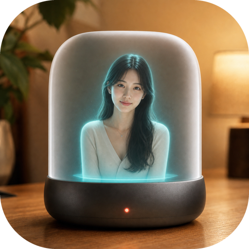

# here

<p align="center">
  
</p>

<p align="center">
  <b>A desktop-resident AI companion with characters, memory, speech, proactive contact, and image selfies.</b>
</p>

<p align="center">
  <a href="README.md">Project README</a>
</p>

<p align="center">
  
  
  
  
</p>

<p align="center">
  <a href="#-features">Features</a>
  ·
  <a href="#-requirements">Requirements</a>
  ·
  <a href="#-installation">Installation</a>
  ·
  <a href="#-configuration">Configuration</a>
  ·
  <a href="#-image-generation-and-selfies">Image Generation</a>
  ·
  <a href="#-acknowledgements">Acknowledgements</a>
  ·
  <a href="#license">License</a>
</p>

here is an AI lover and companion who feels like they live on your desktop. With character profiles, long-term memory, voice, animated sprites, daily-life state, and proactive contact, here does not just wait for you to open a chat box; they can naturally think of you, reach out first, and share little moments from their day through optional current-state photos.

here can use the user's locally installed Hermes Agent for model reasoning, with a bundled OpenAI-compatible Internal Agent as a lightweight fallback. Image generation is provider-agnostic, so Grok Imagine, GPT Image, OpenAI-compatible services, and future adapters can all power the same proactive photo experience.

## ✨ Features

<p align="center">
  
</p>

| Feature | Description | Preview |
| --- | --- | --- |
| Character system | Create, import, and edit personas, visual identity, emotion tags, voice references, and character bundles. |    |
| ASR and TTS | Support microphone voice input, ASR backend selection, TTS playback, and multi-provider voice settings. |     |
| Desktop chat | Dialog, sprite switching, TTS playback, microphone input, history save and restore. |    |
| Agent backend | Choose the user's local Hermes Agent, the bundled Internal Agent fallback, or automatic selection from the main menu. |  |
| Proactive contact | Characters can reach out based on their own daily state through desktop chat or external delivery channels such as WeChat. |    |
| Proactive photos | Proactive contact can attach a natural current-state photo generated from character identity, life state, and optional reference images. |  |
| Configurable image APIs | Switch image-api, Grok Imagine, GPT Image, OpenAI-compatible endpoints, and future adapters without changing the scheduler. |  |

## 💻 Requirements

| Item | Requirement |
| --- | --- |
| Node.js | Required for Electron, Vite, tests, and packaging. |
| Python | Python 3.11 is used by the backend sidecar. |
| Environment manager | [uv](https://docs.astral.sh/uv/) prepares backend development and release runtimes. |
| Desktop UI | Electron with a Vite renderer and TypeScript main process. |
| Optional native extras | Video sprite import and AI background removal are optional extras to keep default installs and release bundles smaller. |
| Local Hermes Agent | If Hermes Agent is not already installed in this project environment, install it with `--with-hermes`. This helper extra is fetched from GitHub and requires Git/network access. |
| ASR | Windows source installs and release bundles provide the lightweight Vosk path by default. Use `--with-asr` for the full ASR extras, such as faster-whisper, RealtimeSTT, and local ASR dependencies needed by non-Windows source environments. |
| TTS and image APIs | Optional. API keys can be entered in the UI or provided through environment variables. |
| External delivery | Optional. WeChat and other delivery channels need their own local configuration. |

On Windows, keep the project in an ASCII-only path such as `D:\here` to avoid path issues in audio, Qt, or embedded Python components.

On macOS source installs, ASR requires Homebrew PortAudio so `pyaudio` can build. Release bundles embed the PortAudio library used by Vosk.

## 📦 Installation

### Source Run

Install the Node and Python dependencies, then start the Electron application:

```bash
npm install
npm run backend:setup
npm run dev
```

The development renderer is available at `http://127.0.0.1:5180`. Optional ASR and Hermes dependencies can be installed with:

```bash
npm run backend:setup:full
```

| Option | Installs | Enables |
| --- | --- | --- |
| `backend:setup` | `backend/requirements.txt` | Base backend dependencies for local development. |
| `backend:setup:full` | ASR and Hermes requirement files | Adds optional ASR and Hermes dependencies; video support is installed from the settings page when needed. |
| Settings page | ASR, video, and Hermes packages | Installs optional packages into the application data directory for packaged applications. |

`backend:setup:full` intentionally excludes video dependencies. Video support is installed on demand from the application settings page.

Source runs download the Vosk model on first use when it is missing. Release bundles include the small Chinese Vosk model, so the default Vosk backend can start without a model download.

### Packaged Builds

Build a local release package with Electron Builder:

```bash
npm run dist
```

The output is written to `release/`. Build on the target platform so Electron Builder packages the correct native runtime.

## ⚙️ Configuration

Default configs contain no real secrets. Electron stores runtime data under the platform application data directory. The development backend uses `backend/.venv`, while packaged applications use their bundled runtime.

```bash
HERE_API_BASE_URL=https://api.openai.com/v1
HERE_API_MODEL=gpt-4o-mini
```

Main configuration entry points:

| Setting | UI |
| --- | --- |
| Agent backend | Settings page and backend configuration |
| TTS | Settings page: voice provider and API credentials |
| ASR | Settings page: recognition backend and model preparation |
| Character memory and animation folders | Settings page: character and storage paths |
| Proactive contact | Settings page: scheduler and delivery channels |
| External delivery such as WeChat | Settings page: platform credentials |
| Proactive photo generation | Settings page: image provider and model |

Useful environment variables:

| Variable | Purpose |
| --- | --- |
| `HERE_API_BASE_URL` | OpenAI-compatible API base URL. |
| `HERE_API_MODEL` | Default model for the internal agent. |
| `OPENAI_API_KEY` | Used by Internal Agent, OpenAI TTS, and GPT Image. |
| `FAL_KEY` / `XAI_API_KEY` | Used by Grok Imagine / fal-style image APIs. |
| `OPENROUTER_API_KEY` | Used by OpenRouter Grok Imagine. |
| `ELEVENLABS_API_KEY` | Used by ElevenLabs TTS. |
| `MINIMAX_API_KEY` / `MINIMAX_GROUP_ID` | Used by MiniMax TTS. |
| `FISH_AUDIO_API_KEY` / `FISH_AUDIO_REFERENCE_ID` | Used by Fish Audio TTS. |
| `HERE_MESSAGING_CONFIG` | Override external messaging config path. |
| `HERE_WECHAT_STATE_DIR` | Override WeChat login state directory. |

API keys can also be entered in the UI. UI-written config is local-only and should not be committed.

## 🖼️ Image Generation And Selfies

Proactive photos are an attachment capability of proactive contact; they do not drive the proactive scheduler by themselves. When enabled, the character may generate a natural current-state photo from daily state, visual identity, and an optional reference image.

<p align="center">
  
</p>

Supported image adapters:

| Adapter | Description |
| --- | --- |
| `image-api` | OpenAI-compatible `/v1/images/generations` or simple image API. |
| `xai-grok-imagine` | fal / OpenRouter / OpenAI-compatible Grok Imagine configuration. |
| `openai-gpt-image` | OpenAI GPT Image images API with reference-image edits. |

Each adapter exposes its own URL, API key, model, size, quality, and related options in `Proactive selfie image settings`.

## 🙏 Acknowledgements

here is inspired by [openai/codex](https://github.com/openai/codex)'s pet, [RachelForster/Shinsekai](https://github.com/RachelForster/Shinsekai), [SumeLabs/clawra](https://github.com/SumeLabs/clawra), and [xiangking/agent-pet](https://github.com/xiangking/agent-pet). Thank you to their creators and contributors for what they have shared with the open-source community.

## License

here is released under the [PolyForm Noncommercial License 1.0.0](LICENSE). Commercial use is not permitted without separate written permission.
