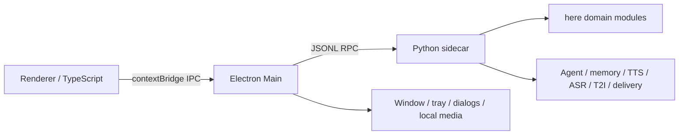

# here Electron

`here-Electron` 是 Qt/PySide6 版 [here](../here) 的 Electron 桌面实现。功能对齐基线为原项目提交：

```text
2e782b26ca83e92ee9c484c5a095f5331526d72b
```

迁移遵守两个边界：

- 原 `here` 仓库只作为只读参考，不修改其代码和数据。
- Electron 运行数据写入 Electron 自己的 `userData/python-data`；旧版数据只能通过“导入旧版数据”显式复制。

## 架构



Electron 负责窗口、托盘、系统文件对话框、本地媒体和安全 IPC；Python sidecar 继续使用原版的 Agent、记忆、生活计划、主动联系、语音、图像与消息平台领域代码。Qt UI、`QThread` 和 Qt signal/slot 不进入新运行时。

## 开发

需要 Node.js、npm、Python 3.11 和 `uv`。

```bash
npm install
npm run backend:setup
npm run dev
```

完整可选能力：

```bash
npm run backend:setup:full
```

开发地址固定为 `http://127.0.0.1:5180`。Vite 页面在普通浏览器中使用 mock API；由 Electron 打开时使用 preload 暴露的真实 API。

后端命令会根据当前系统自动选择 Python 虚拟环境路径（Unix 使用 `.venv/bin`，Windows 使用 `.venv/Scripts`）。

## 验证

```bash
npm run typecheck
npm test
npm run backend:test
npm run build
```

## 打包

```bash
npm run dist
```

`backend:runtime` 会准备可搬运 CPython、安装基础依赖和 Vosk/PyAudio、重签 PortAudio 本地库，并用真实 JSONL RPC 做冒烟测试。发布包不依赖开发 `.venv` 或原 `here` 目录。

macOS 产物写入 `release/`。没有 Apple Developer ID 时能生成 `.app/.dmg/.zip`，但跨机器打开会受到 Gatekeeper 提示；正式分发需配置签名与公证。

Windows 发布请在 Windows 环境执行 `npm run dist`，这样 `backend:runtime` 才会下载并打包 Windows 版本的 CPython、PyAudio 和 Vosk，然后由 Electron Builder 生成 NSIS 安装包。macOS 目录中的 runtime 是 macOS 专用，不能直接用于 Windows。

## 数据与迁移

- macOS 默认数据：`~/Library/Application Support/here-electron/python-data`
- Windows/Linux：跟随 Electron `app.getPath("userData")`
- 旧数据导入只读取所选目录，然后复制 `config/memory/characters/backgrounds/state/character_templates`
- 自定义角色记忆目录和资产目录仍由原 `storage_paths.yaml` 语义管理

功能对齐证据见 [功能对齐矩阵](docs/FUNCTION_PARITY.md)，迁移方法和经验见 [Qt 到 Electron 迁移总结](docs/QT_TO_ELECTRON_MIGRATION.md)。
