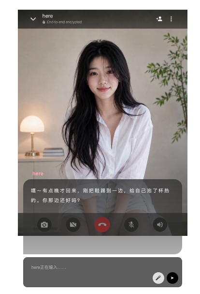

# here

<p align="center">
  
</p>

<p align="center">
  <b>A desktop-resident AI companion with characters, memory, speech, proactive contact, and image selfies.</b>
</p>

<p align="center">
  <a href="README.md">English</a>
  ·
  <a href="README.zh-CN.md">简体中文</a>
  ·
  <a href="README.zh-TW.md">繁體中文</a>
  ·
  <a href="README.ja.md">日本語</a>
  ·
  <a href="README.ko.md">한국어</a>
</p>

<p align="center">
  
  
  
  
</p>

<p align="center">
  <a href="#-features">Features</a>
  ·
  <a href="#-requirements">Requirements</a>
  ·
  <a href="#-installation">Installation</a>
  ·
  <a href="#-configuration">Configuration</a>
  ·
  <a href="#-image-generation-and-selfies">Image Generation</a>
  ·
  <a href="#-acknowledgements">Acknowledgements</a>
  ·
  <a href="#license">License</a>
</p>

here is an AI lover and companion who feels like they live on your desktop. With character profiles, long-term memory, voice, animated sprites, daily-life state, and proactive contact, here does not just wait for you to open a chat box; they can naturally think of you, reach out first, and share little moments from their day through optional current-state photos.

here can use the user's locally installed Hermes Agent for model reasoning, with a bundled OpenAI-compatible Internal Agent as a lightweight fallback. Image generation is provider-agnostic, so Grok Imagine, GPT Image, OpenAI-compatible services, and future adapters can all power the same proactive photo experience.

## ✨ Features

<p align="center">
  
</p>

| Feature | Description | Preview |
| --- | --- | --- |
| Character system | Create, import, and edit personas, visual identity, emotion tags, voice references, and character bundles. |    |
| ASR and TTS | Support microphone voice input, ASR backend selection, TTS playback, and multi-provider voice settings. |     |
| Desktop chat | Dialog, sprite switching, TTS playback, microphone input, history save and restore. |    |
| Agent backend | Choose the user's local Hermes Agent, the bundled Internal Agent fallback, or automatic selection from the main menu. |  |
| Proactive contact | Characters can reach out based on their own daily state through desktop chat or external delivery channels such as WeChat. |    |
| Proactive photos | Proactive contact can attach a natural current-state photo generated from character identity, life state, and optional reference images. |  |
| Configurable image APIs | Switch image-api, Grok Imagine, GPT Image, OpenAI-compatible endpoints, and future adapters without changing the scheduler. |  |

## 💻 Requirements

| Item | Requirement |
| --- | --- |
| Python | Validated on Python 3.11 to 3.13. |
| Environment manager | [uv](https://docs.astral.sh/uv/) is required for source installs and development. |
| Desktop UI | PySide6 / Qt runtime. |
| Optional native extras | Video sprite import and AI background removal are optional extras to keep default installs and release bundles smaller. |
| Local Hermes Agent | If Hermes Agent is not already installed in this project environment, install it with `--with-hermes`. This helper extra is fetched from GitHub and requires Git/network access. |
| ASR | Windows source installs and release bundles provide the lightweight Vosk path by default. Use `--with-asr` for the full ASR extras, such as faster-whisper, RealtimeSTT, and local ASR dependencies needed by non-Windows source environments. |
| TTS and image APIs | Optional. API keys can be entered in the UI or provided through environment variables. |
| External delivery | Optional. WeChat and other delivery channels need their own local configuration. |

On Windows, keep the project in an ASCII-only path such as `D:\here` to avoid path issues in audio, Qt, or embedded Python components.

On macOS source installs, ASR requires Homebrew PortAudio so `pyaudio` can build. Release bundles embed the PortAudio library used by Vosk.

## 📦 Installation

### Source Run

Source development and runtime are managed with uv. Do not manage the project environment with a system Python or manual `pip install`.
If uv is not already available, the install and start scripts will install it automatically through Astral's official installer.

Windows users should run the batch scripts from PowerShell or Command Prompt:

```powershell
.\install.bat
.\start.bat
```

Do not run the `.sh` scripts from Git Bash on Windows; they are for macOS/Linux only.

macOS and Linux users should run the shell scripts:

```bash
bash scripts/install.sh
bash scripts/start.sh
```

Optional native capabilities can be added when needed. Use the same option names on each platform:

```powershell
.\install.bat --with-asr
.\install.bat --with-video
.\install.bat --with-background-removal
.\install.bat --with-hermes
.\install.bat --full
```

```bash
bash scripts/install.sh --with-asr
bash scripts/install.sh --with-video
bash scripts/install.sh --with-background-removal
bash scripts/install.sh --with-hermes
bash scripts/install.sh --full
```

| Option | Installs | Enables |
| --- | --- | --- |
| `--with-asr` | `pyaudio`, `vosk`, `faster-whisper`, `RealtimeSTT` | Full ASR extras: adds advanced/alternative backends such as faster-whisper and RealtimeSTT, plus local speech dependencies for non-Windows source environments. The basic Windows Vosk path does not require it. |
| `--with-video` | `opencv_python` | Extracting frames from video files when creating or editing character sprite animations. Still images, multi-image frame imports, and Codex Pet imports do not need it. |
| `--with-background-removal` | `rembg` | AI background removal for imported character images, useful for transparent sprite assets. |
| `--with-hermes` | `hermes-agent` | Installs Hermes Agent into this project environment for the local Agent backend. Requires Git and network access. |
| `--full` | ASR, video import, and AI background-removal native extras | Installs the local native capabilities in one pass; does not include Hermes Agent. |

`--full` installs the native extras, but it intentionally does not install Hermes Agent because that package is fetched from GitHub. Use `--with-hermes` only when you need here to install Hermes Agent into this environment.

On macOS, ASR extras require Homebrew PortAudio. The installer checks Homebrew and installs `portaudio` before running `uv sync --extra asr`, so `pyaudio` can build from a clean environment.

Source runs download the Vosk model on first use when it is missing. Release bundles include the small Chinese Vosk model, so the default Vosk backend can start without a model download.

### Packaged Builds

Release bundles include start scripts. Source development should still use uv; packaged scripts prefer the bundled runtime when available.

Build a local macOS bundle from the source tree:

```bash
python3 scripts/build_bundle.py --target macos-arm64 --name here-local-macos-arm64-lite
```

GitHub Releases are built by `.github/workflows/release.yml` for macOS arm64 and Windows x64. Use the launcher for your platform.

macOS/Linux:

```bash
bash scripts/start.sh
```

Windows:

```powershell
.\start.bat
```

Release bundles include the Vosk ASR runtime and the small Chinese Vosk model for first-run voice input. Video import, faster-whisper, RealtimeSTT, and AI background-removal dependencies remain optional.

## ⚙️ Configuration

Default configs contain no real secrets. Source runs store local data under `.local/here/`; packaged apps use the platform application data directory. You can override the app data root:

```bash
HERE_APP_HOME=/path/to/here-data uv run python -m app.desktop.main
```

Main configuration entry points:

| Setting | UI |
| --- | --- |
| Agent backend | Main menu: `API / Agent backend` |
| TTS | Main menu: `TTS settings` |
| ASR | Main menu: `Speech recognition ASR` |
| Character memory and animation folders | Main menu: `Character data folders` |
| Proactive contact | Main menu: `Let her reach out first` |
| External delivery such as WeChat | Main menu: `Chat platform settings` |
| Proactive photo generation | Main menu: `Proactive selfie image settings` |

Useful environment variables:

| Variable | Purpose |
| --- | --- |
| `HERE_APP_HOME` | Override local config, memory, generated files, and state directory. |
| `OPENAI_API_KEY` | Used by Internal Agent, OpenAI TTS, and GPT Image. |
| `FAL_KEY` / `XAI_API_KEY` | Used by Grok Imagine / fal-style image APIs. |
| `OPENROUTER_API_KEY` | Used by OpenRouter Grok Imagine. |
| `ELEVENLABS_API_KEY` | Used by ElevenLabs TTS. |
| `MINIMAX_API_KEY` / `MINIMAX_GROUP_ID` | Used by MiniMax TTS. |
| `FISH_AUDIO_API_KEY` / `FISH_AUDIO_REFERENCE_ID` | Used by Fish Audio TTS. |
| `HERE_MESSAGING_CONFIG` | Override external messaging config path. |
| `HERE_WECHAT_STATE_DIR` | Override WeChat login state directory. |

API keys can also be entered in the UI. UI-written config is local-only and should not be committed.

## 🖼️ Image Generation And Selfies

Proactive photos are an attachment capability of proactive contact; they do not drive the proactive scheduler by themselves. When enabled, the character may generate a natural current-state photo from daily state, visual identity, and an optional reference image.

<p align="center">
  
</p>

Supported image adapters:

| Adapter | Description |
| --- | --- |
| `image-api` | OpenAI-compatible `/v1/images/generations` or simple image API. |
| `xai-grok-imagine` | fal / OpenRouter / OpenAI-compatible Grok Imagine configuration. |
| `openai-gpt-image` | OpenAI GPT Image images API with reference-image edits. |

Each adapter exposes its own URL, API key, model, size, quality, and related options in `Proactive selfie image settings`.

## 🙏 Acknowledgements

here is inspired by [openai/codex](https://github.com/openai/codex)'s pet, [RachelForster/Shinsekai](https://github.com/RachelForster/Shinsekai), [SumeLabs/clawra](https://github.com/SumeLabs/clawra), and [xiangking/agent-pet](https://github.com/xiangking/agent-pet). Thank you to their creators and contributors for what they have shared with the open-source community.

## License

here is released under the [PolyForm Noncommercial License 1.0.0](LICENSE). Commercial use is not permitted without separate written permission.
