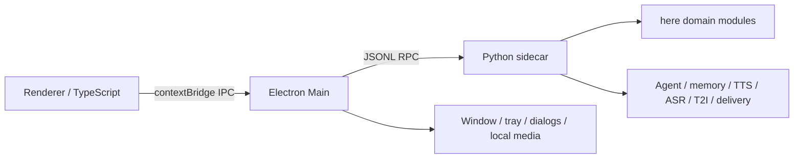

# here Electron

`here-Electron` 是 Qt/PySide6 版 [here](../here) 的 Electron 桌面实现。功能对齐基线为原项目提交：

```text
2e782b26ca83e92ee9c484c5a095f5331526d72b
```

迁移遵守两个边界：

- 原 `here` 仓库只作为只读参考，不修改其代码和数据。
- Electron 运行数据写入 Electron 自己的 `userData/python-data`；旧版数据只能通过“导入旧版数据”显式复制。

## 架构



Electron 负责窗口、托盘、系统文件对话框、本地媒体和安全 IPC；Python sidecar 继续使用原版的 Agent、记忆、生活计划、主动联系、语音、图像与消息平台领域代码。Qt UI、`QThread` 和 Qt signal/slot 不进入新运行时。

## 开发

需要 Node.js、npm、Python 3.11 和 `uv`。

```bash
npm install
npm run backend:setup
npm run dev
```

开发地址固定为 `http://127.0.0.1:5180`。Vite 页面在普通浏览器中使用 mock API；由 Electron 打开时使用 preload 暴露的真实 API。

`npm run backend:setup`（`scripts/backend-tasks.mjs setup`）用 `uv` 创建 `backend/.venv` 并安装 `backend/requirements.txt` 的基础依赖。后端命令会根据当前系统自动选择虚拟环境路径（Unix 使用 `.venv/bin`，Windows 使用 `.venv/Scripts`）。

需要 ASR、视频或 Hermes 等可选能力时：

```bash
npm run backend:setup:full
```

`backend:setup:full` 在 `backend:setup` 之后追加安装 `backend/requirements-asr.txt`（`pyaudio`、`vosk==0.3.44`、`faster-whisper`、`RealtimeSTT`）和 `backend/requirements-hermes.txt`（`hermes-agent`，从 Git 安装）。

## 依赖安装方式

开发环境依赖与发布包运行时是两条不同的路径，互不替代：

| 方式 | 命令 / 入口 | 安装位置 | 适用场景 |
| --- | --- | --- | --- |
| 开发基础依赖 | `npm run backend:setup` | `backend/.venv`（`backend/requirements.txt`） | 本地开发运行 sidecar |
| 开发完整依赖 | `npm run backend:setup:full` | `backend/.venv`（追加 `requirements-asr.txt`、`requirements-hermes.txt`） | 本地开发的 ASR / 视频 / Hermes |
| 设置页按需安装 | 设置页「安装当前识别依赖」「安装视频立绘支持」「安装 Hermes Agent」，对应 RPC `install_dependencies` | 应用数据目录下的 `cache/python-packages/py3.11`，运行时加入 `sys.path` | 已安装的桌面应用按需补齐可选能力 |
| 发布包运行时 | `npm run backend:runtime` | `backend/runtime/`（可搬运 CPython + `backend/requirements-runtime.txt`） | 打包发布包（`npm run dist`） |

设置页按需安装的功能名：ASR 取决于当前「识别后端」（`vosk`、`faster_whisper`、`realtime_stt`），视频为 `video`，另有 `hermes`。安装需要能访问 pip 源（Hermes 还需要 `git` 与 GitHub 访问权限）和可写的应用数据目录；完成后页面会自动重新检查依赖状态，Vosk 还需用「检查 / 预载模型」下载模型，个别能力可能需要重启应用才会生效。

## 验证

```bash
npm run typecheck
npm test
npm run backend:test
npm run build
```

## 打包

```bash
npm run dist
```

`npm run dist` 依次执行 `npm run build`、`npm run backend:runtime` 和 `electron-builder`。

`npm run backend:runtime`（`backend/build_runtime.py`）需要 `uv`，并会：

1. 下载当前平台的 python-build-standalone CPython 3.11 到 `backend/runtime/`；
2. 安装 `backend/requirements-runtime.txt`；
3. 在 macOS 上要求 Homebrew，用 `brew --prefix portaudio`（缺失时自动 `brew install portaudio`）编译 PyAudio，复制并重签 `libportaudio.2.dylib`；
4. 清理测试文件，并用真实 JSONL RPC 做 `ping` 冒烟测试。

发布包不依赖开发 `.venv` 或原 `here` 目录。当 `backend/runtime/` 已按当前平台构建且冒烟通过时，命令会直接复用；需要强制重建时执行 `npm run backend:runtime -- --force`。

### Vosk / PyAudio 的平台差异

`backend/requirements-runtime.txt` 用平台条件控制语音依赖，因此不同平台的发布运行时并不相同：

| 平台 | 发布运行时是否包含 `pyaudio` / `vosk` | 说明 |
| --- | --- | --- |
| macOS | 是 | 需要 Homebrew；PyAudio 链接并重签打包的 PortAudio |
| Windows | 是 | 使用预编译 wheel；请在 Windows 环境执行 `npm run dist` |
| Linux | 否 | 平台条件不满足，发布运行时只有基础依赖，不含 Vosk/PyAudio |

Linux 发布包默认不含语音识别；如需在 Linux 使用，请在开发环境安装系统 PortAudio 开发包后用 `npm run backend:setup:full`，或自行放开 `backend/requirements-runtime.txt` 的平台条件并重建运行时。

macOS 产物写入 `release/`。没有 Apple Developer ID 时能生成 `.app/.dmg/.zip`，但跨机器打开会受到 Gatekeeper 提示；正式分发需配置签名与公证。

Windows 发布请在 Windows 环境执行 `npm run dist`，这样才会打包 Windows 版本的 CPython 和 Vosk/PyAudio，然后由 Electron Builder 生成 NSIS 安装包。macOS 目录中的 runtime 是 macOS 专用，不能直接用于 Windows。

## 故障排查

### 依赖安装失败

- 设置页按需安装需要访问 pip 源；Hermes 还需要 `git` 与 GitHub 访问权限。网络不可用时错误会显示在设置页，恢复网络或代理后重试；也可以改用命令行 `npm run backend:setup:full`。
- 按需安装写入应用数据目录下的 `cache/python-packages/py3.11`，请确认该目录可写且磁盘空间充足。
- 安装失败不会让界面卡在忙碌状态：成功、非零退出、超时或子进程启动失败都会清除忙碌状态，并在状态文本中保留可读的错误尾部。

### 系统音频库缺失

- macOS：PyAudio 需要 PortAudio，先执行 `brew install portaudio`（`backend:runtime` 会自动尝试安装）。
- Linux：需要系统开发包，例如 Debian/Ubuntu 的 `portaudio19-dev`，以及 `build-essential`、`python3-dev`。
- Windows：通常直接使用 PyAudio 预编译 wheel，无需额外系统库。

### 安装后仍显示缺少依赖

- 设置页安装完成后会自动重新检查；Vosk 还需点「检查 / 预载模型」下载模型。
- 若某个能力仍未生效，重启应用让 sidecar 重新加载用户安装的包。

## 数据与迁移

- macOS 默认数据：`~/Library/Application Support/here-electron/python-data`
- Windows/Linux：跟随 Electron `app.getPath("userData")`
- 旧数据导入只读取所选目录，然后复制 `config/memory/characters/backgrounds/state/character_templates`
- 导入会读取旧数据的 `storage_paths.yaml`，把自定义角色记忆/资产目录的内容一并复制到 Electron 数据目录，并改用 Electron 自己的存储配置；原目录保持不变

功能对齐证据见 [功能对齐矩阵](docs/FUNCTION_PARITY.md)，迁移方法和经验见 [Qt 到 Electron 迁移总结](docs/QT_TO_ELECTRON_MIGRATION.md)。
